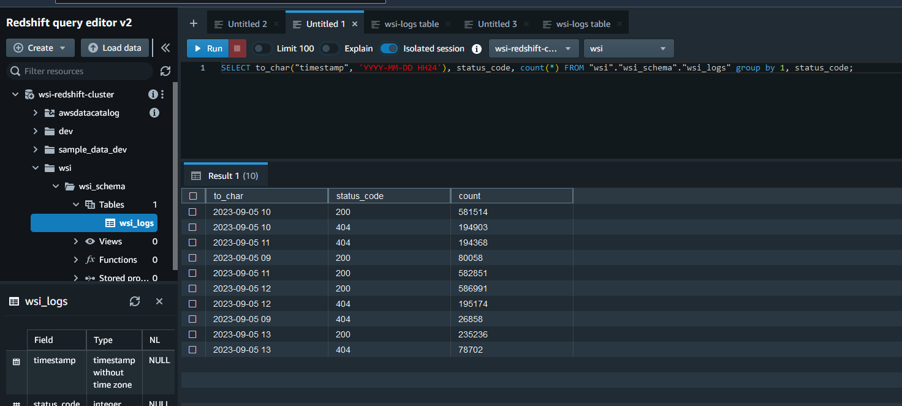

proba:



ad-hoc:
```sql
SELECT COUNT(*) FROM "wsi-glue-db"."wsi-glue-table" WHERE year='2023' and month='09' and "date"='04';
```
```sql
SELECT COUNT(*), hour FROM "wsi-glue-db"."wsi-glue-table" WHERE year='2023' and month='09' and "date"='04' group by hour;
```

flink:
```sql
%flink.ssql

DROP TABLE IF EXISTS wsi_log_test;

CREATE TABLE wsi_log_test (
  `time` STRING,
  `timestamp` AS TO_TIMESTAMP(LEFT(`time`, 19)),
  `remote_addr` STRING,
  `method` STRING,
  `path` STRING,
  `status_code` STRING
)
WITH (
  'connector' = 'kinesis',
  'stream' = 'wsi-log',
  'aws.region' = 'ap-northeast-2',
  'scan.stream.initpos' = 'LATEST',
  'format' = 'json'
);
```
```sql
%flink.ssql

SELECT COUNT(*) FROM wsi_log_test WHERE MINUTE(`timestamp`) BETWEEN MINUTE(NOW())-10 AND MINUTE(NOW());
```
```sql
%flink.ssql

SELECT COUNT(*), `path`, `method`, `status_code` FROM wsi_log_test WHERE MINUTE(`timestamp`) BETWEEN MINUTE(NOW())-10 AND MINUTE(NOW()) GROUP BY `path`, `method`, `status_code`;
```

redshift:
```sql
SELECT to_char("timestamp", 'YYYY-MM-DD HH24'), count(*) FROM "wsi"."wsi_schema"."wsi_logs" group by 1;
```
```sql
SELECT to_char("timestamp", 'YYYY-MM-DD HH24'), status_code, count(*) FROM "wsi"."wsi_schema"."wsi_logs" group by 1, status_code;
```
